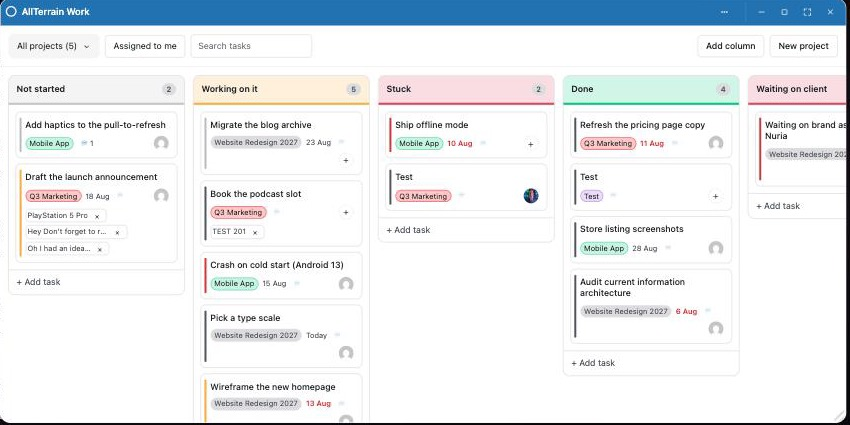
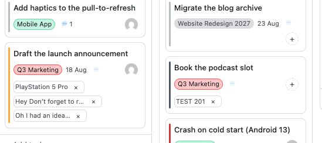
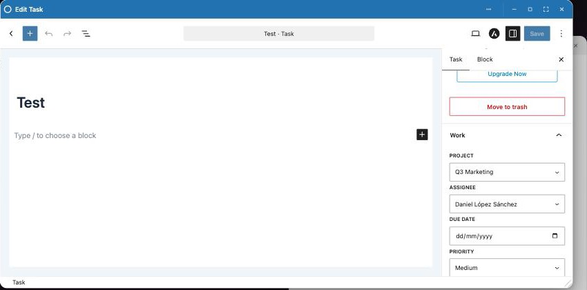
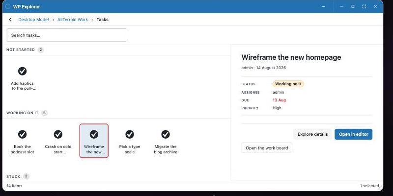

<div align="center">

# AllTerrain Work

**Projects and tasks on a drag-and-drop board — a Monday-shaped work tracker built as an
[OpenStation](https://github.com/WordPress/openstation) desktop app, on top of ordinary WordPress objects.**

[](https://wordpress.org)
[](https://php.net)
[](LICENSE)
[](#testing)



</div>

---

## What it is

A board with a column per status and a card per task. Drag a card between columns and it
moves — drop it on another card and the pointer's height picks its place. Filter by
project, by "assigned to me", or by typing. Add tasks inline at the foot of any column.

Two decisions shape everything else.

### It is a native OpenStation window, never an iframe

The board renders into the shell's own DOM. That is what gives it `wp.os.dragManager` —
the same pointer pipeline the desktop's file tiles ride — so a page dragged out of WP
Explorer can be dropped onto a card and attached, and a card lifted here carries the
payload type `allterrain-work/task` for any other plugin to receive. None of that is
reachable from inside an iframe.

### Everything is a post

A project is a post, a task is a post, a status is a term, a comment is a comment.
Nothing lives in a bespoke table, so the REST API, `current_user_can()`, revisions,
autosave, search, the trash, the Comments screen and every plugin hooking `save_post`
already work on this data. The WordPress **Abilities API** is registered on top, so an AI
assistant or MCP client can create, move, assign, attach and comment through fourteen
typed, permission-checked abilities.

With OpenStation absent or switched off, the same bundle renders on a plain wp-admin page
under **Work**. Cards still drag between columns; what they cannot do is leave the page,
because there is nothing to leave it for.

---

## A card



Each card carries a coloured project chip, a due date that turns red when it passes, a
priority stripe down its leading edge, a 💬 count, an assignee avatar you can press, and a
chip per attached item.

| Drop this | Here | And |
|---|---|---|
| A card | Anywhere in a column, including **on another card** | It moves |
| A post / page / media / CPT | On a card | It is attached |
| A user | On a card | It is assigned |
| Anything that is not a task | On a column | Refused, visibly |

**A column takes tasks and nothing else.** A column is a status, so a task is the only
thing that can be in one. Content belongs *on* a card, where it attaches.

---

## Assigning

Three ways, because one of them being a drag gesture is not enough:

- **Click the avatar on any card** — a searchable picker of people who can actually be
  assigned work. Unassigned cards show a dashed **+**, so the affordance is visible
  without hovering.
- **The Gutenberg sidebar** — the *Work* panel's Assignee field.
- **Drag a user tile onto a card** from WP Explorer.

The picker lists users holding `edit_posts`, not the whole user list: assigning work to
somebody who cannot open it is a way of losing the work, and a picker listing a thousand
subscribers is a picker nobody can use.

## Comments

Every card has a 💬 button — always, even at zero, because a thread you can only find once
somebody else has started it is a thread nobody starts. Enter sends, Shift+Enter breaks
the line.

The thread is **ordinary WordPress comments**, so it is the same rows the admin's Comments
screen moderates and OpenStation's Comments window lists.

## Attaching things

Drag anything that lives in `wp_posts` onto a card — a post, a page, an image, a product,
a custom type nobody has written yet — and it is attached and shown with a link to it.
Attachments are stored as a list of post ids, which is why one field covers every type.

Detaching removes the **link**, never the thing. Same principle one level up: trashing a
project keeps its tasks, and since the project is only trashed, restoring it brings the
board back intact.

---

## Fields, in the editor



| Task | Project |
|---|---|
| Project, Assignee, Due date, Priority | Lead, State, Starts, Target, Colour |

The panel is written against the `wp.*` globals rather than importing `@wordpress/*`, so
it adds no second copy of React to a plugin that also loads where the editor does not
exist. A project's Colour is worn by its chips on the board.

---

## WP Explorer



Both post types share one **AllTerrain Work** folder with per-section icons. Inside it the
Explorer is decorated through its own documented seams:

| Seam | What it does |
|---|---|
| `preview-extras` (`meta`) | Status, assignee, due, priority — and for a project, state, lead, dates and colour |
| `preview-extras` (`footer`) | **Open this project on the board** — opens the board already filtered to it |
| `list-bands` | The Tasks grid is banded by status column, so the folder has the board's shape |
| `list-tile` | Overdue tasks are ringed, so late work is visible before you click it |
| `get_the_excerpt` | Tile summaries read `Stuck · Ana · Overdue 10 Aug` |

Two things are load-bearing and easy to get wrong. The section must declare `listFields`,
or the window's `_fields` list strips the meta and the status off every row. And the
status arrives under the taxonomy's `rest_base` (`atwork-statuses`), not its slug — asking
for the slug is answered with silence.

---

## Staying live

The board and the widget subscribe to OpenStation's own content-change topics —
`os.atwork-task.changed` **and** `os.atwork-project.changed`. Changes arrive three ways:
instantly from this browser, instantly from a Gutenberg save, and within one Heartbeat
tick from any other tab or any other user. Rename a project in the editor and every chip
and dropdown on the board follows without a reload.

Moves are the one mutation the framework cannot see for itself — dropping a card writes
`menu_order` straight through `$wpdb` to avoid a revision per card, which fires no
`save_post` — so `atwork_record_change()` reports them by hand.

---

## Requirements

- WordPress 6.0+
- PHP 7.4+
- **[OpenStation](https://github.com/WordPress/openstation) — required.** Declared as
  `Requires Plugins: desktop-mode`, so WordPress 6.5+ will not activate this plugin
  without it. The board is a native window on the desktop and every drag gesture in it is
  the shell's pointer pipeline; there is no version of this that works alone.
- The Abilities API *(optional — WordPress 6.9+, or any plugin that bundles it)*

## Install

Install [OpenStation](https://github.com/WordPress/openstation) first, then grab the zip
from [Releases](https://github.com/AllTerrainDeveloper/allterrain-work/releases) and upload
it at **Plugins → Add New → Upload Plugin** — the built bundles are in the package, so
there is nothing to compile.

To work on it instead:

```bash
git clone https://github.com/AllTerrainDeveloper/allterrain-work
cd allterrain-work
npm install
npm run build          # all bundles (dev + min), then deploys to a sibling WP checkout
```

Activate **AllTerrain Work** on the Plugins screen. Activation seeds four statuses — Not
started, Working on it, Stuck, Done — if the site has none.

## Commands

```bash
npm run build            # all bundles, then deploy
npm run dev              # watch-build the board bundle
npm run typecheck        # tsc --noEmit
npm test                 # vitest
npm run test:php         # PHPUnit
npm run lint:php         # WordPress Coding Standards

npm run env:start        # wp-env, for the PHP suite and Plugin Check
npm run plugin:package   # -> dist/allterrain-work.zip
npm run plugin:check     # WordPress.org's own Plugin Check
npm run plugin:release   # build + check + package, the full gate
```

## Testing

135 PHPUnit tests and 64 vitest tests, all green, plus `phpcs` clean against the WordPress
Coding Standards.

`npm run test:php` needs a WordPress test library and a MySQL server, neither of which is
in this repository. It finds them in whichever environment is actually up — the local
docker-compose QA site if it is running, otherwise [wp-env](https://www.npmjs.com/package/@wordpress/env)
from `.wp-env.json` — and skips with a note when neither is. One command rather than one
per environment, so the suite cannot quietly stop being run on either.

`.wp-env.json` mounts the repo with `mappings` rather than listing it under `plugins`,
which would make wp-env *activate* it. It can't: the plugin requires OpenStation, and a
bare wp-env has none, so WordPress refuses and `wp-env start` fails before any test runs.
Mounted inactive everything still works — the PHPUnit bootstrap loads the plugin itself,
and Plugin Check reads files.

## Releasing

`npm run plugin:package` stages the tree, checks that all four places carrying the version
agree, and writes `dist/allterrain-work.zip`. What ships is decided in one place —
`bin/ships.mjs` — which both the packager and Plugin Check read, so the check can never be
blind to something the zip does contain. Nothing beginning with a dot ever ships.

Pushing a `vX.Y.Z` tag runs [`release.yml`](.github/workflows/release.yml): it verifies the
tag against the plugin header, `ATWORK_VERSION`, `readme.txt`'s Stable tag and
`package.json`, runs Plugin Check, attaches the zip to a GitHub Release, and deploys stable
tags to WordPress.org. Prereleases (`v1.0.0-rc1`) stop at the GitHub Release.

---

## The desktop surfaces

| Surface | What it is |
|---|---|
| Native window `allterrain-work` | The board. Dock tile + desktop icon |
| Widget `allterrain-work/my-work` | Your open tasks, soonest first, with a project picker |
| Command `allterrain-work` | "Work: open the board" in the palette |
| Drag payload `allterrain-work/task` | What a lifted card carries; `data.task` is the full task |

Accepting a dropped card from another plugin:

```js
wp.os.dragManager.registerDropTarget( {
    id: 'my-plugin/schedule',
    element: myCalendarEl,
    accept: ( payload ) => payload.type === 'allterrain-work/task',
    acceptLabel: 'Schedule this task',
    onDrop: ( session ) => {
        const { task } = session.payload.data;
        console.log( task.title, task.due );
    },
} );
```

---

## Hooks

```php
// Content
apply_filters( 'atwork_default_statuses', $statuses );        // seeded columns
apply_filters( 'atwork_done_status_slugs', array( 'done' ) ); // what counts as finished
apply_filters( 'atwork_status_palette', $colours );           // colours new columns cycle through
apply_filters( 'atwork_task_summary_parts', $parts, $post );  // the WP Explorer tile summary
apply_filters( 'atwork_assignee_query', $args, $search );     // who can be assigned work

// Surfaces
apply_filters( 'atwork_needs_admin_page', $needed );          // force the wp-admin board back on
apply_filters( 'atwork_script_config', $config );             // what the bundles receive
apply_filters( 'atwork_editor_config', $config, $type );      // what the Gutenberg panel receives

// Lifecycle
do_action( 'atwork_task_created', $task_id, $task );
do_action( 'atwork_task_updated', $task_id, $task );
do_action( 'atwork_task_moved', $task_id, $status_id, $task );
do_action( 'atwork_task_attached', $task_id, $ids );
do_action( 'atwork_task_commented', $comment_id, $task_id );
do_action( 'atwork_project_created', $post_id, $project );
do_action( 'atwork_project_trashed', $project_id );
do_action( 'atwork_status_created', $term_id, $status );
do_action( 'atwork_abilities_registered' );
```

## REST

Both post types are `show_in_rest`, so `/wp/v2/atwork-tasks` and `/wp/v2/atwork-projects`
handle ordinary CRUD including meta. The plugin's own namespace covers what core cannot
express in one round trip:

| Route | Why it exists |
|---|---|
| `GET /allterrain-work/v1/board` | Columns, projects and cards together — the board cannot paint from any two |
| `POST /allterrain-work/v1/tasks/<id>/move` | A status change and a column reorder as one atomic write |
| `GET /allterrain-work/v1/my-work` | One person's queue, sorted by urgency |
| `GET /allterrain-work/v1/projects/<id>` | A project's counts, per-column breakdown and members |
| `POST /allterrain-work/v1/statuses` | Add a board column without leaving the board |
| `GET /allterrain-work/v1/assignees` | Searchable list of people who can be assigned work |
| `GET`/`POST /allterrain-work/v1/tasks/<id>/comments` | The task's discussion |
| `POST`/`DELETE /allterrain-work/v1/tasks/<id>/links` | Attach and detach |

## Abilities

Registered under the `allterrain-work` category when the Abilities API is present:

`list-projects` · `list-statuses` · `list-tasks` · `create-project` · `create-status` ·
`create-task` · `update-task` · `move-task` · `my-work` · `trash-task` · `attach-to-task` ·
`detach-from-task` · `trash-project` · `comment-on-task`

Each is a thin wrapper over the same helper the board uses, so an agent moving a card and
a person dragging one reach identical code — including the permission check.

---

## Layout

```
allterrain-work.php          bootstrap: constants, requires, activation
includes/
  shell-api.php              resolves openstation_* / desktop_mode_* spellings
  content-types.php          post types, status taxonomy, task + project meta
  helpers.php                the real API: read the board, create, move, attach, comment
  rest.php                   the board-shaped routes
  abilities.php              fourteen WordPress Abilities over the same helpers
  assets.php                 script + style handles, mtime cache-busting, config
  admin-page.php             the Work menu; the no-shell fallback page
  editor.php                 enqueues the Gutenberg sidebar panel
  explorer.php               WP Explorer folder, icons, tile summaries, banding fields
  openstation.php            native window, desktop icon, widget, command
src/
  index.ts                   board entry — native window + admin page
  board.ts                   the board itself
  widget.ts                  the My Work desktop widget
  editor.ts                  the Gutenberg document sidebar panel
  explorer.ts                WP Explorer previews, banding and tile marks
  dnd.ts                     shell drag manager, and a fallback with its interface
  desktop-drops.ts           reading what the desktop dropped on a card
  assignee-picker.ts         the searchable assign popover
  comments.ts                the task thread
  os-ui.ts                   <os-select> / <os-button> where the shell provides them
  open.ts                    links open desktop windows, not browser tabs
  inline-ui.ts               ask / confirm / notice — never a browser modal
  focus.ts                   cross-bundle "show me this project" hand-off
  api.ts                     REST client + the content-change subscription
  dates.ts                   due-date arithmetic, shared by board and widget
  types.ts                   wire shapes, twinned with includes/helpers.php
```

### A note on the post type names

`atwork-project` and `atwork-task`, not `allterrain-work-*`. `register_post_type()` caps a
key at 20 characters and `allterrain-work-` is 16 of them, so the longer name would fail
registration outright. The taxonomy cap is 32; `atwork-status` keeps the prefix for
consistency rather than necessity.

---

## License

GPL-2.0-or-later. See [LICENSE](LICENSE).
